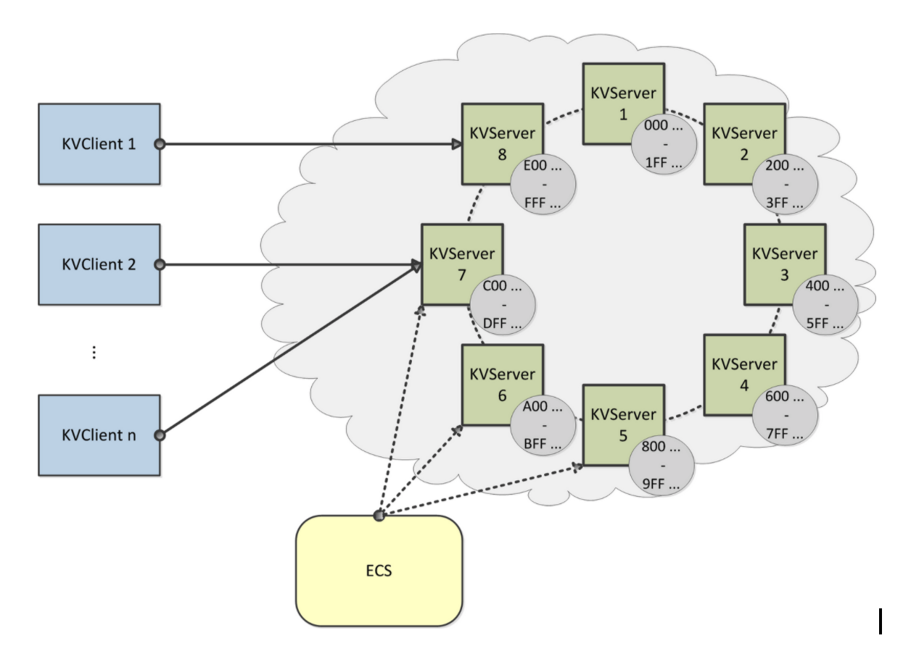

# Distributive-Storage-System
Distributive Storage System to implement a scalable key-value storage system capable of responding to high volume client storage requests seamlessly.

Created by Johnathon Martin and Lunjun Zhang
# Milestone 1
The first milestone for this project was implementing a client server system capable of proccessing put, get and remove requests.

Storage was written to disk in the form of a JSON file for easy lookup and removal of key-value pairs.  Writing the values to disks allowed the server to maintain storage upon server shutdown/restart.  The Server-Client cummunication was implemented via a socket programming.  A simple parser was implemented client-side inorder to user to interact with the client interface.

The storage server is implemented using multithreading and Read Write locks in order to eliminate race conditions while keeping read times fast.

Here is a simple diagram demenstrating how the client-server communication works at a high level.

# Milestone 2
In milestone 2 a scalable multi-server system was implemented using a ECS and Zookeeper inorder to manage the servers and their metadata.

Each server and client holds metadata of the current server topology to ensure their requests get forwarded to the correct server.

Zookeeper manages each server node.  It is responsible for adding and removing nodes while applying locks to ensure data consistency as well as the detection of a failed node.

Each server is responsible for a range on the hash-ring, each hash is created with a WD5 hash of the concatanated the servers IP address and port.

The hash range each server serves can change upon the addition of a new server thus moving data techniques must be implemented to move the data no longer in each hash range to the proper server.  Similar considerations apply for the removal of nodes.

When the client sends a request to a server that doesn't service the specified hash the server will then respond with a NOTRESPONSIBLEFORHASH error to inform the client to reconnect to the correct server.

Here is a diagram of the high level model

# Milestone 3
This is Milestone 3
# Milestone 4
This is Milestone 4
