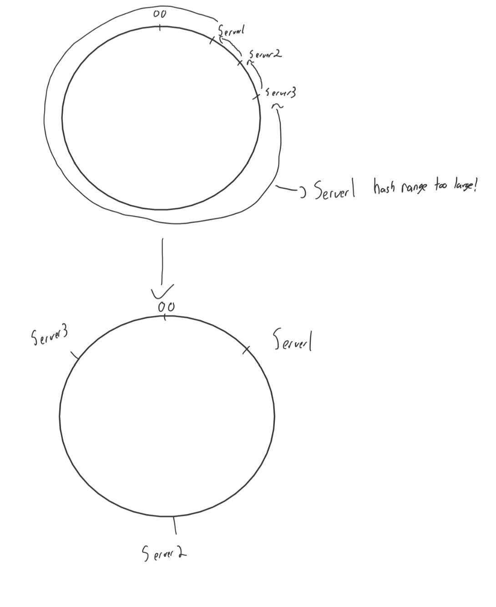

# Distributive-Storage-System
Distributive Storage System to implement a scalable key-value storage system capable of responding to high volume client storage requests seamlessly.

Created by Johnathon Martin and Lunjun Zhang
# Milestone 1
The first milestone for this project was implementing a client server system capable of processing put, get and remove requests.

Storage was written to disk in the form of a JSON file for easy lookup and removal of key-value pairs.  Writing the values to disks allowed the server to maintain storage upon server shutdown/restart.  The Server-Client communication was implemented via a socket programming.  A simple parser was implemented client-side in order to user to interact with the client interface.

The storage server is implemented using multithreading and Read Write locks in order to eliminate race conditions while keeping read times fast.

Here is a simple diagram demonstrating  how the client-server communication works at a high level:

# Milestone 2
In milestone 2 a scalable multi-server system was implemented using a ECS and Zookeeper in order to manage the servers and their metadata.

Each server and client holds metadata of the current server topology to ensure their requests get forwarded to the correct server.

Zookeeper manages each server node.  It is responsible for adding and removing nodes while applying locks to ensure data consistency as well as the detection of a failed node.

Each server is responsible for a range on the hash-ring, each hash is created with a WD5 hash of the concatenated the servers IP address and port.

The hash range each server serves can change upon the addition of a new server thus moving data techniques must be implemented to move the data no longer in each hash range to the proper server.  Similar considerations apply for the removal of nodes.

When the client sends a request to a server that doesn't service the specified hash the server will then respond with a NOTRESPONSIBLEFORHASH error to inform the client to reconnect to the correct server.

Here is a diagram of the high level model:

# Milestone 3
In Milestone 3 the primary objective was to implement replication with eventual consistency to hold replicates at the 2 successer nodes and to maintain this replication server scaling and server failure.

Basic replication is achieved by each put request communicating with the coordinator node and then the coordinating node forwards the replicates to the 2 successor nodes.  This ensures eventual consistency.  Get requests can then be serviced by either the coordinator or the successor nodes as they are read-only.

Scalability is implemented by communication from the ECS to the nodes when the metadata changes.  Similar to before data must be moved between nodes but this time the replication data will also have to be moved adding complexity to the problem.

Failure detection and replication is implemented from the ECS nodes.  When one fails Zookeeper notifies the system.  Then the replication data stored can be used to restore the lost data to the coordinator.

Here is a simple diagram of how the replication works with the coordinator and successors:

# Milestone 4
The objective for milestone 4 was to design our own addition in order to increase the functionality of the system. 

Our idea was a dynamic load balancing system in order to ensure the hash ranges for each server were of relatively equal sizes while minimizing data transfers.
A sketch for the goal of our design can be seen below:

This was implemented via a balance server function which took the range of each server as well as the total number of servers and if they don't comply within the acceptable range move the key of the successor server forward to the point where the threshold is satisfied.

This function is then repeated on loop until all of the server ranges fall within the acceptable threshold and thus the ranges will be balanced.  

